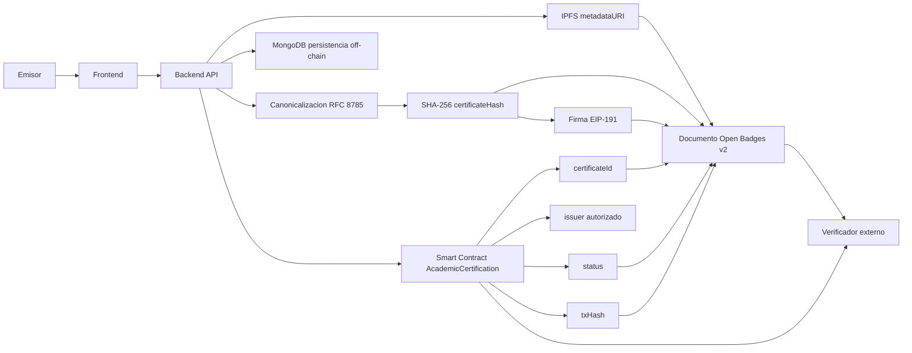
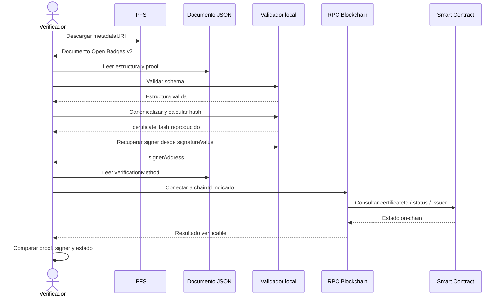
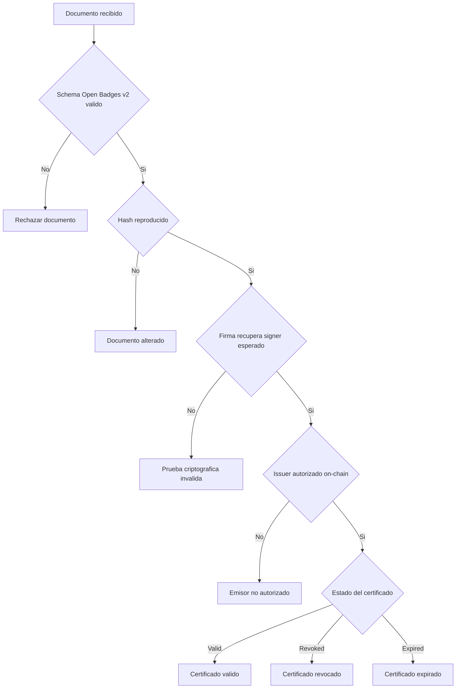

# Diagramas de Estructura y Verificacion del Certificado

Fecha de actualizacion: 29 de marzo de 2026

Este documento resume la estructura logica del certificado, la relacion entre los componentes off-chain y on-chain, y el proceso de verificacion independiente de terceros.

## 1) Estructura del documento de certificado

```mermaid
flowchart TB
    C[AcademicCertificateDocument]

    C --> M1[@context]
    C --> M2[id]
    C --> M3[type Assertion]
    C --> M4[issuedOn]
    C --> B[badge]
    C --> V[verification]
    C --> R[recipient]
    C --> P[proof]
    C --> BC[blockchain]
    C --> S[status]

    B --> B1[name]
    B --> B2[description]
    B --> BI[issuer]
    BI --> BI1[name]
    BI --> BI2[url]

    V --> V1[type BlockchainSignature]
    V --> V2[publicKey]
    V --> V3[verificationMethod]

    R --> R1[type email]
    R --> R2[identity hash]
    R --> R3[salt]
    R --> R4[hashed true]

    P --> P1[certificateHash]
    P --> P2[hashAlgorithm]
    P --> P3[signatureType]
    P --> P4[signatureValue]
    P --> P5[signerAddress]
    P --> P6[verificationMethod]

    BC --> BC1[network]
    BC --> BC2[chainId]
    BC --> BC3[contractAddress]
    BC --> BC4[transactionHash]
    BC --> BC5[certificateId]
    BC --> BC6[metadataURI]

    S --> S1[current]
    S --> S2[revocationReason]
    S --> S3[revokedAt]
    S --> S4[revokedBy]
```

## 2) Relacion entre fuentes de verdad



## 3) Flujo de verificacion independiente



## 4) Mapa de validaciones criticas



## Notas

- La estructura del documento describe el certificado emitido y publicado.
- La fuente de verdad del estado final sigue siendo la blockchain para vigencia, revocacion y autorizacion del emisor.
- IPFS y MongoDB cumplen funciones distintas: distribucion del documento y persistencia operativa, respectivamente.