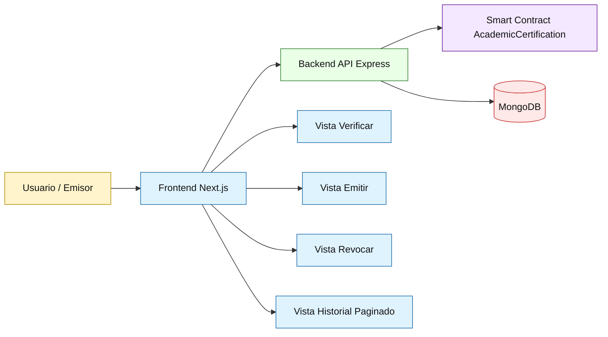
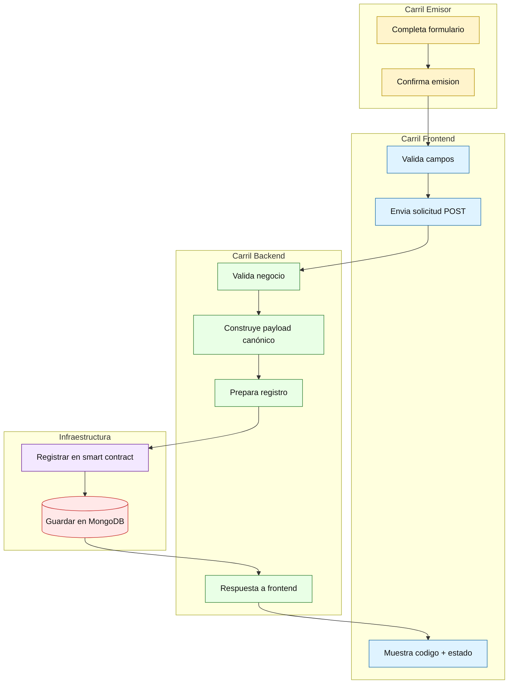
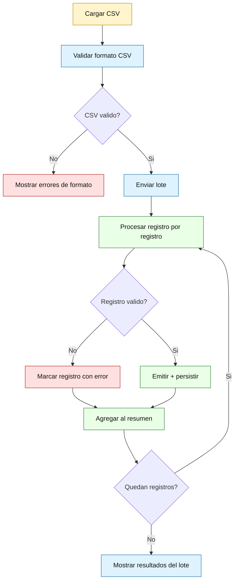
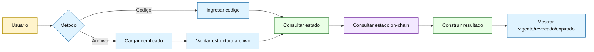
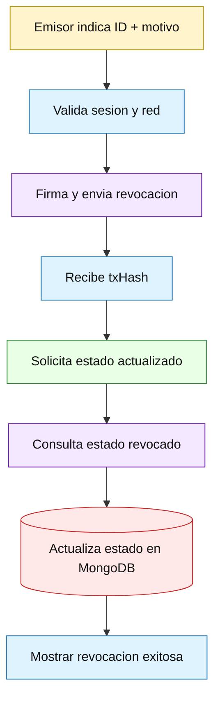
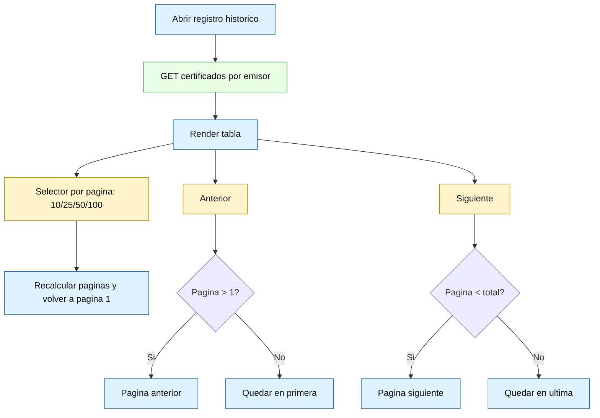
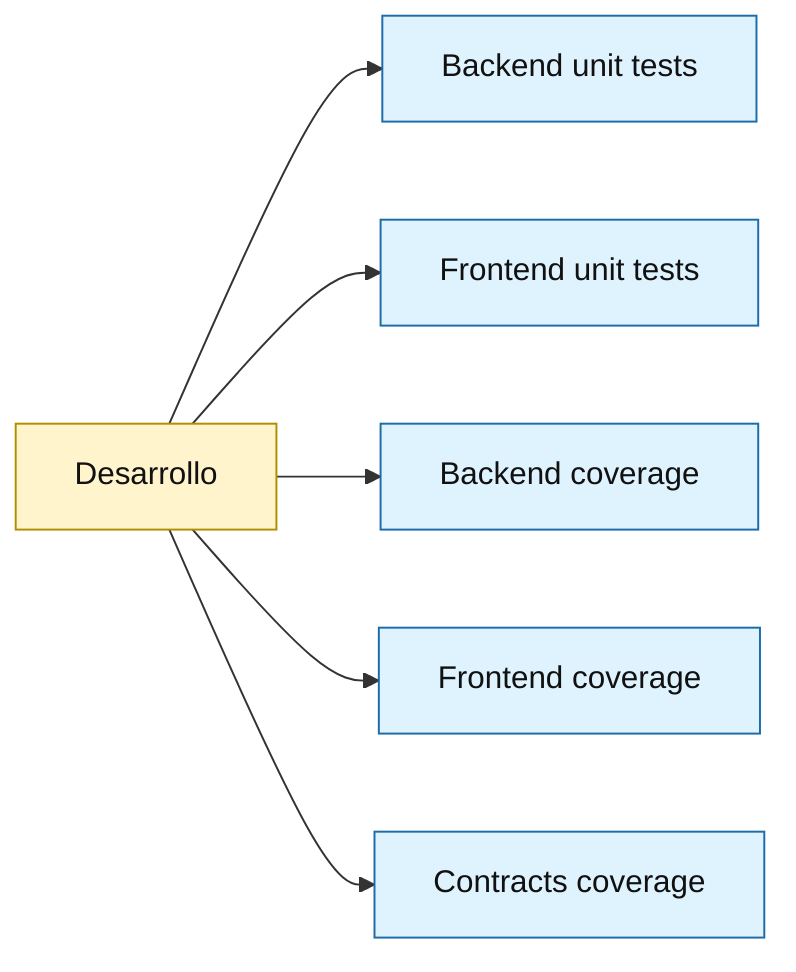

# Diagramas Ilustrados (Mermaid)

Fecha de actualización: 29 de marzo de 2026

Este documento contiene una versión visual de los flujos con estilo tipo "dibujitos" (bloques, colores y carriles por rol).

## Recomendación de visualización

Para ver estos diagramas con mejor calidad, se recomienda abrir este archivo en una app Markdown con motor Mermaid dedicado.

- Windows: Typedown (recomendado).
- macOS: equivalente con soporte Mermaid (por ejemplo, Mark Text, Typora o Mermaid Chart).

Nota: en algunos navegadores y en la vista previa de VS Code el render puede verse con estilos incompletos o menos legibles.

## 1) Mapa visual de la aplicación

## 2) Emisión individual (swimlanes)

## 3) Emisión por lote (con decisiones)

## 4) Verificación (código o archivo)

## 5) Revocación

## 6) Historial paginado

## 7) Mapa de pruebas y cobertura

Comandos:

- backend unit test: npm test
- frontend unit test: npm test
- backend coverage: npm run test:coverage
- frontend coverage: npm run test:coverage
- contracts coverage: npm run hh:coverage
