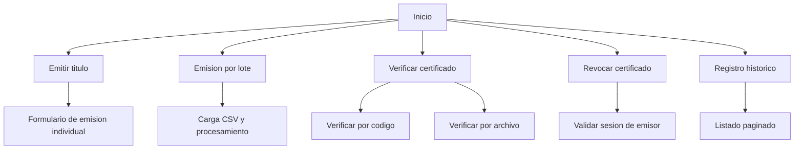
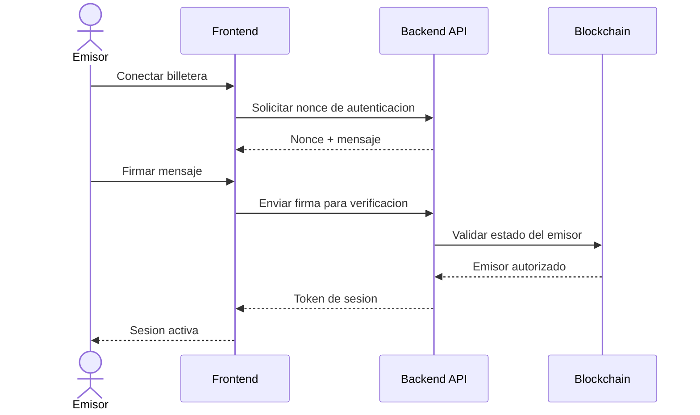
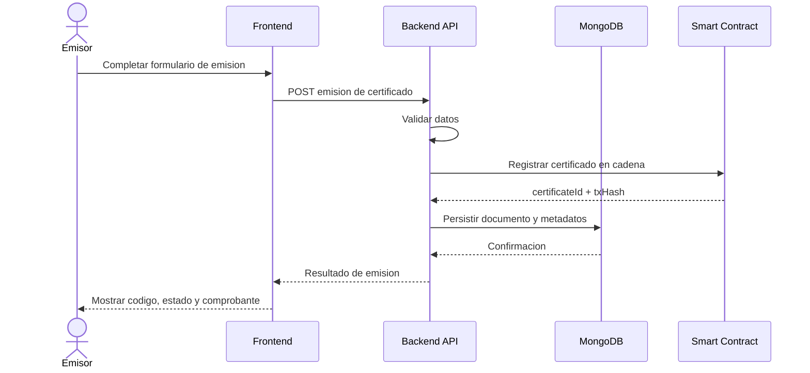
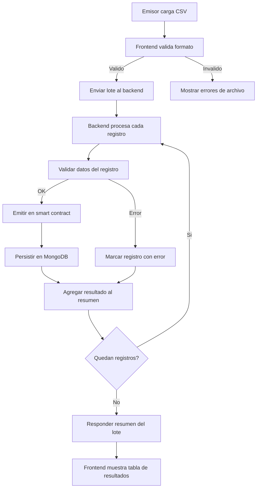
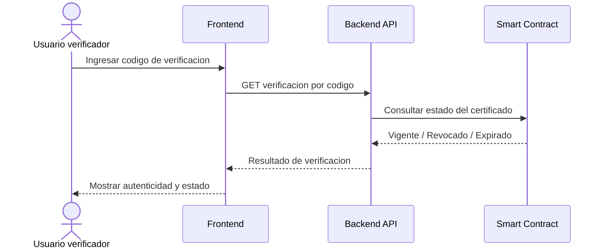
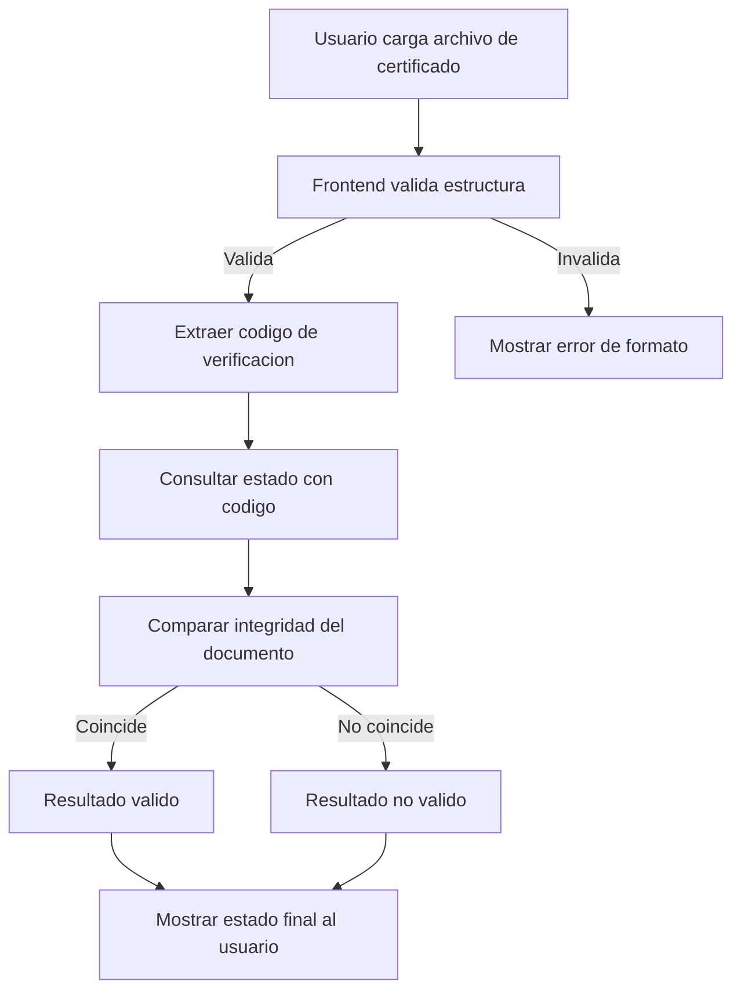
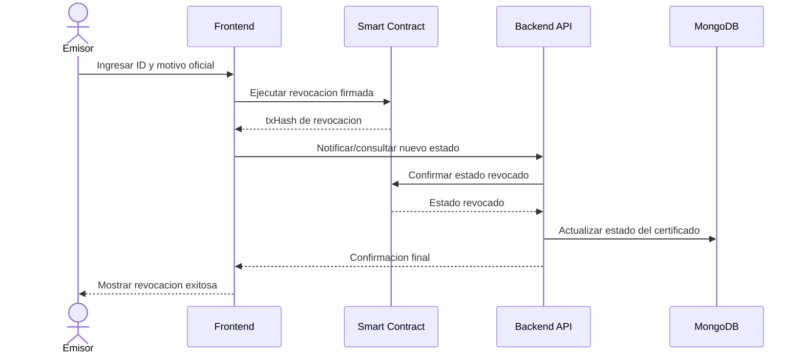
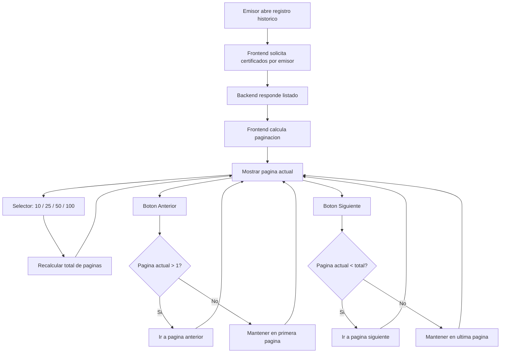
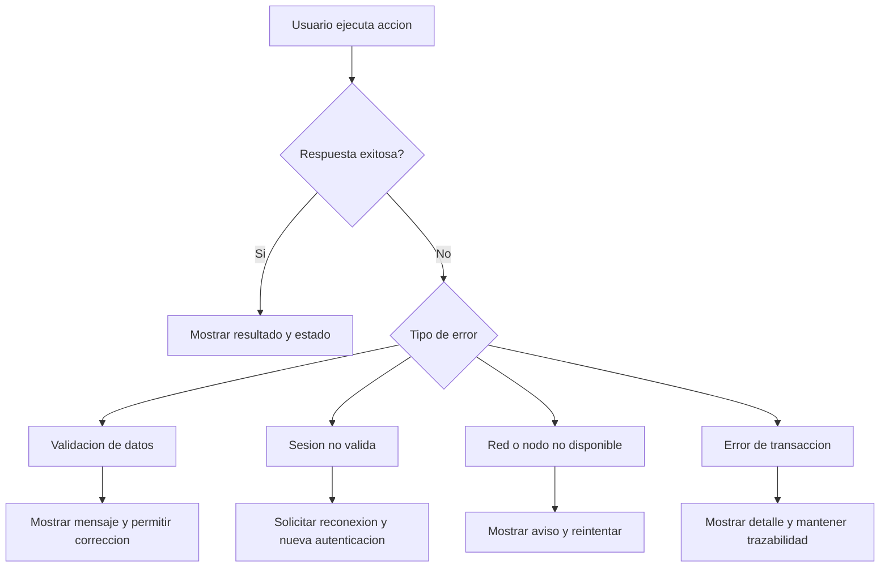
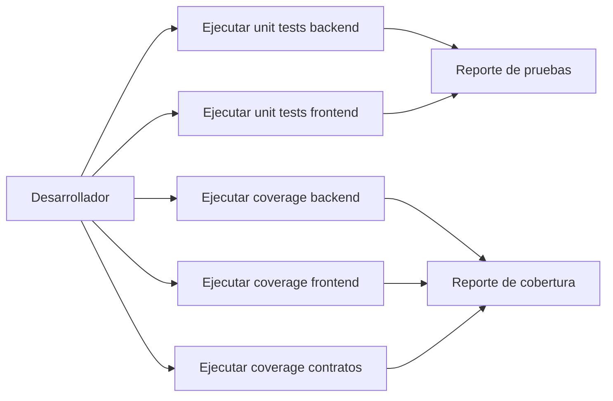

# Diagramas de Flujos de la Aplicación

Fecha de actualización: 29 de marzo de 2026

Este documento incluye los flujos funcionales principales de la aplicación con actores, entidades y decisiones.

Versión visual ilustrada: ver docs/diagramas-ilustrados.md

Diagramas estructurales del certificado: ver docs/certificate-model-diagrams.md

Recomendación de visualización: para mejor render Mermaid, abrir docs/diagramas-ilustrados.md en una app dedicada (Windows: Typedown; macOS: Mark Text, Typora o Mermaid Chart). En navegador o vista previa de VS Code puede verse menos legible.

## Entidades y actores

- Usuario verificador
- Emisor
- Frontend (Next.js)
- Backend API (Express)
- Smart Contract AcademicCertification (ERC-721)
- MongoDB
- Red blockchain

## 1) Mapa general de navegación

## 2) Flujo de autenticación del emisor

## 3) Flujo de emisión individual

## 4) Flujo de emisión por lote

## 5) Flujo de verificación por código

## 6) Flujo de verificación por archivo

## 7) Flujo de revocación

## 8) Flujo de registro histórico paginado

## 9) Flujo de manejo de errores en UI

## 10) Flujo de cobertura y pruebas unitarias

Comandos asociados:

- backend unit test: npm test
- frontend unit test: npm test
- backend coverage: npm run test:coverage
- frontend coverage: npm run test:coverage
- contracts coverage: npm run hh:coverage
