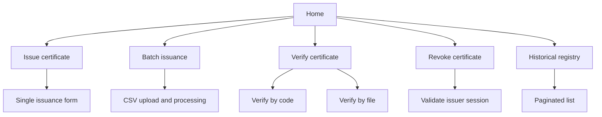
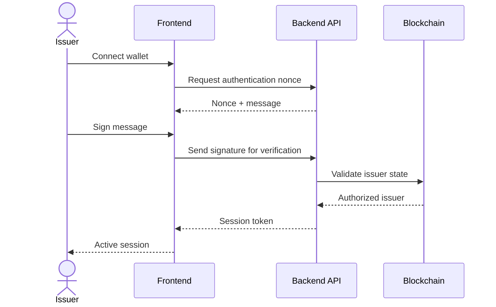
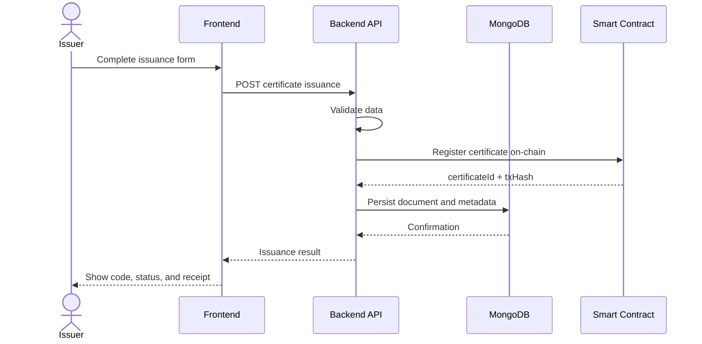
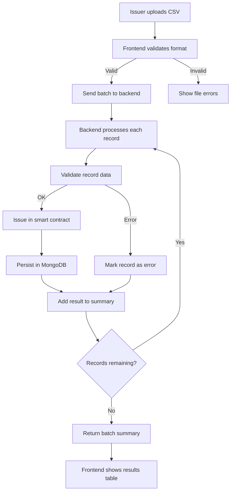
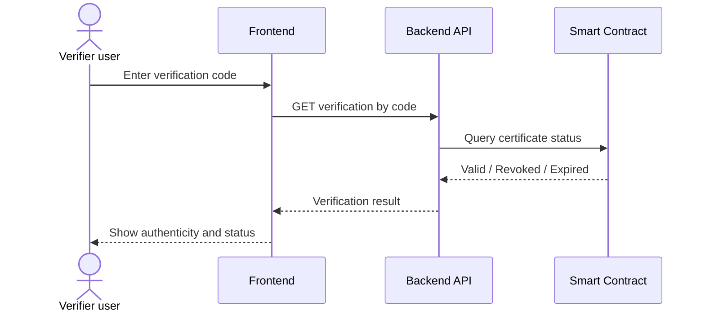
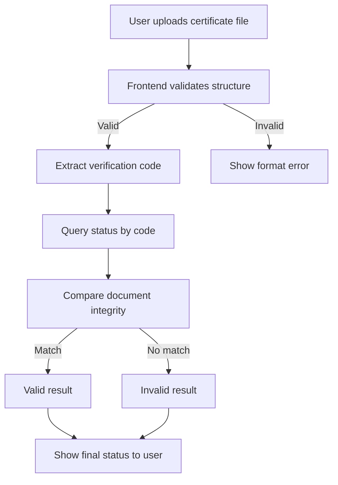
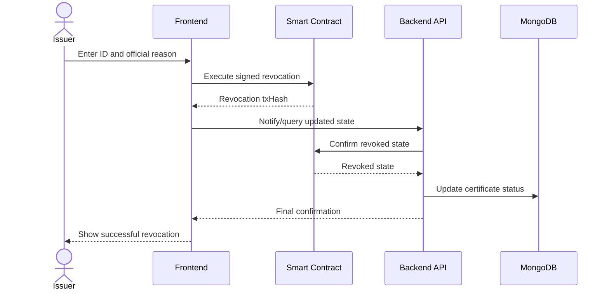
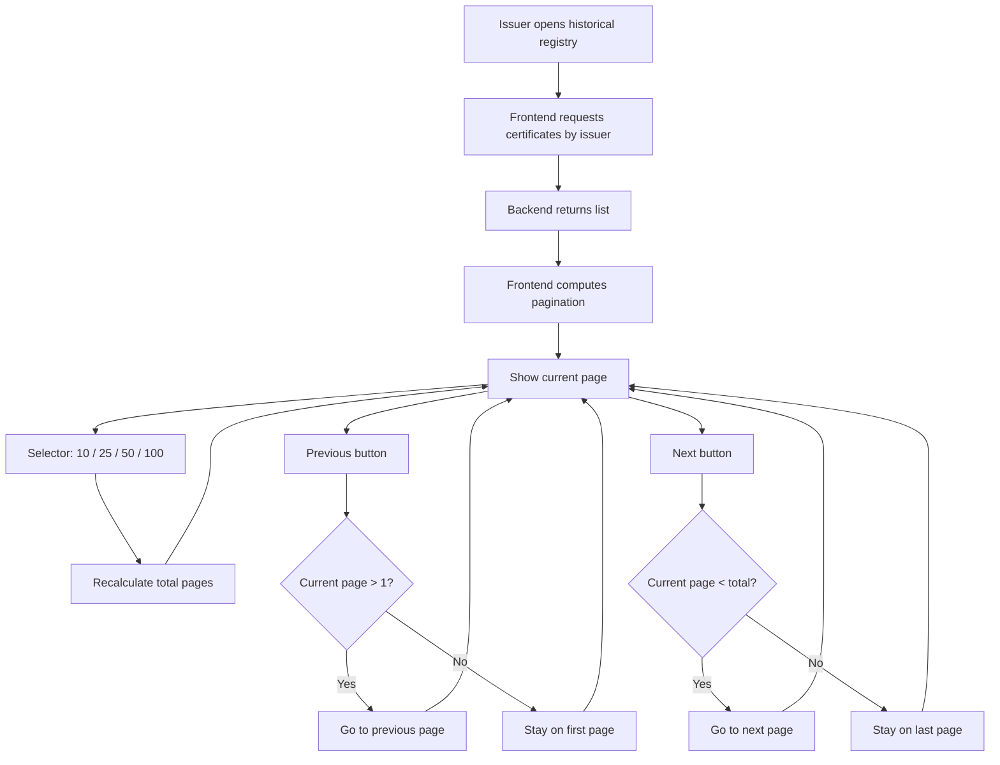
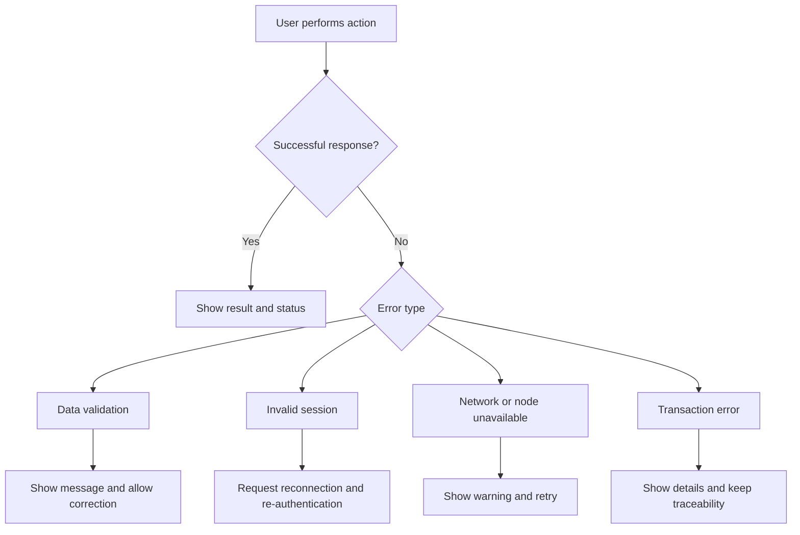
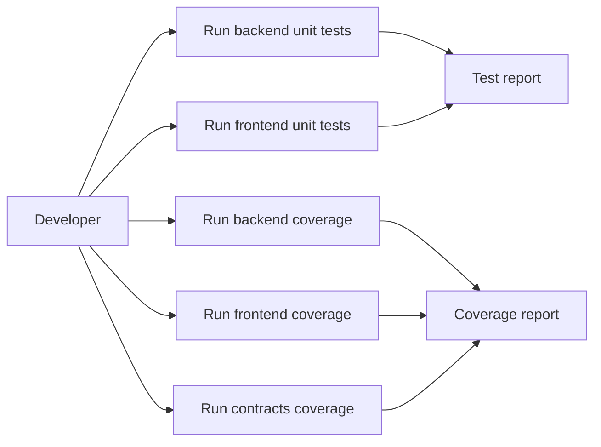

# Application Flow Diagrams

Last updated: March 29, 2026

This document includes the main functional flows of the application with actors, entities, and decisions.

Illustrated visual version: see docs/illustrated-diagrams.md

Certificate structural diagrams: see docs/certificate-model-diagrams.md

Viewing recommendation: for better Mermaid rendering, open docs/illustrated-diagrams.md in a dedicated app (Windows: Typedown; macOS: Mark Text, Typora, or Mermaid Chart). In browser or VS Code preview, it may appear less readable.

## Entities and actors

- Verifier user
- Issuer
- Frontend (Next.js)
- Backend API (Express)
- AcademicCertification Smart Contract (ERC-721)
- MongoDB
- Blockchain network

## 1) General navigation map

## 2) Issuer authentication flow

## 3) Single issuance flow

## 4) Batch issuance flow

## 5) Verification by code flow

## 6) Verification by file flow

## 7) Revocation flow

## 8) Paginated historical registry flow

## 9) UI error handling flow

## 10) Coverage and unit testing flow

Associated commands:

- backend unit test: npm test
- frontend unit test: npm test
- backend coverage: npm run test:coverage
- frontend coverage: npm run test:coverage
- contracts coverage: npm run hh:coverage
