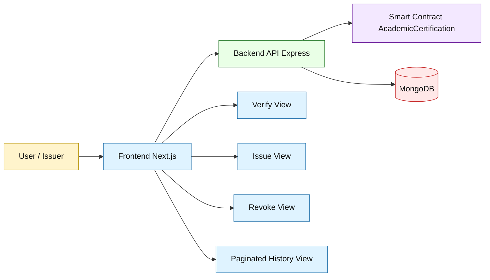
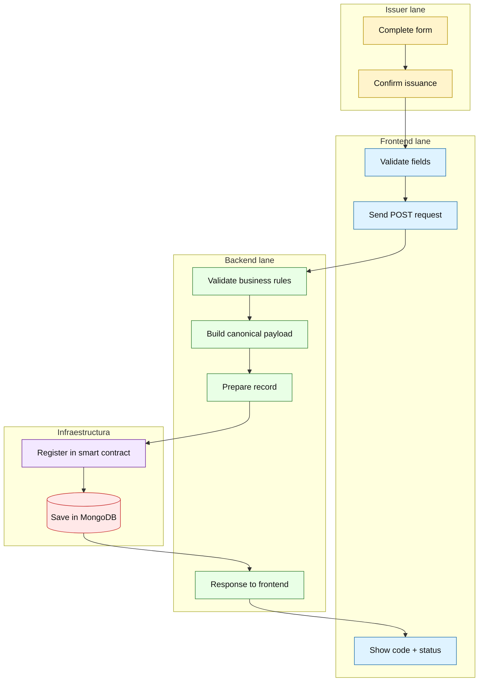
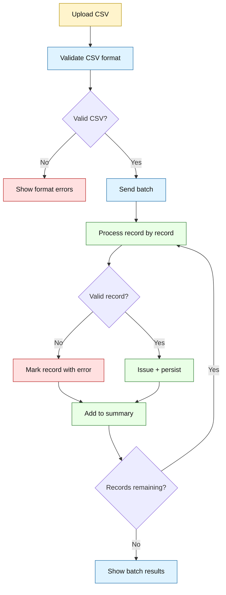
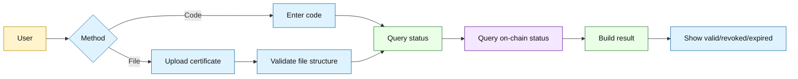
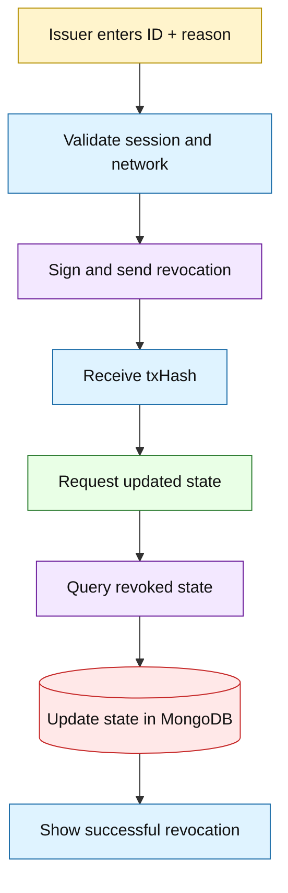
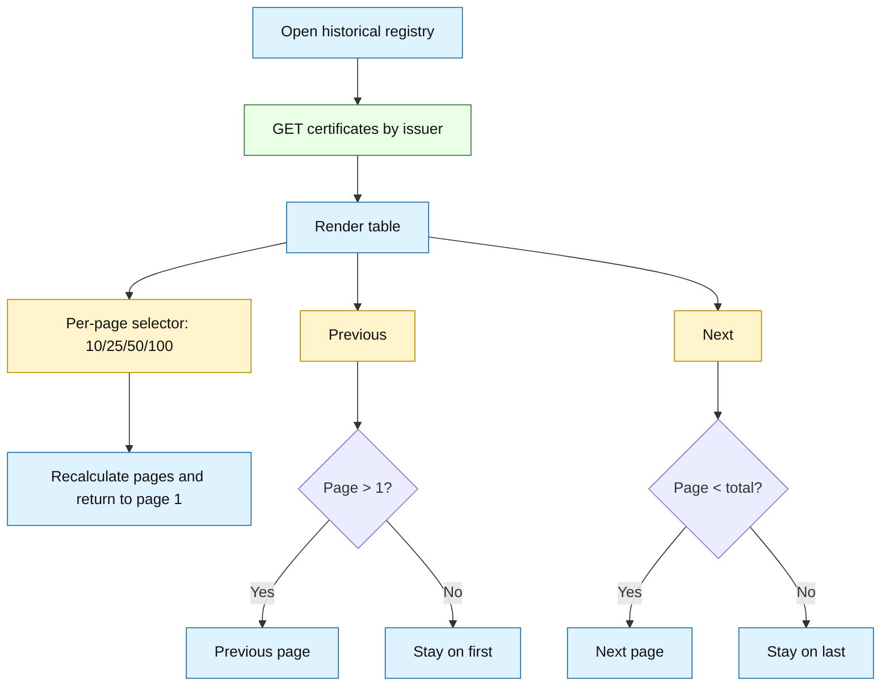
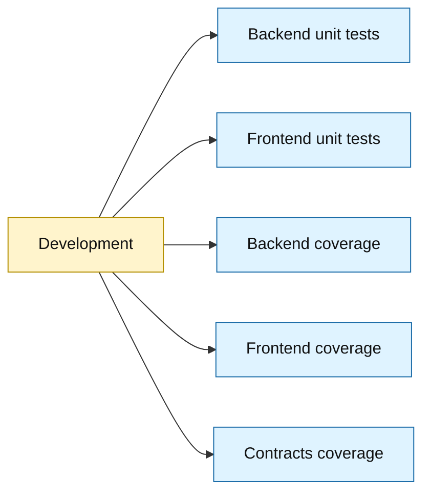

# Illustrated Diagrams (Mermaid)

Last updated: March 29, 2026

This document contains a visual version of the flows with a sketch-style look (blocks, colors, and role-based lanes).

## Viewing recommendation

To view these diagrams with better quality, open this file in a Markdown app with a dedicated Mermaid engine.

- Windows: Typedown (recommended).
- macOS: equivalent with Mermaid support (for example, Mark Text, Typora, or Mermaid Chart).

Note: in some browsers and in VS Code preview, rendering may appear with incomplete styles or reduced readability.

## 1) Visual application map

## 2) Single issuance (swimlanes)

## 3) Batch issuance (with decisions)

## 4) Verification (code or file)

## 5) Revocation

## 6) Paginated history

## 7) Testing and coverage map

Commands:

- backend unit test: npm test
- frontend unit test: npm test
- backend coverage: npm run test:coverage
- frontend coverage: npm run test:coverage
- contracts coverage: npm run hh:coverage
