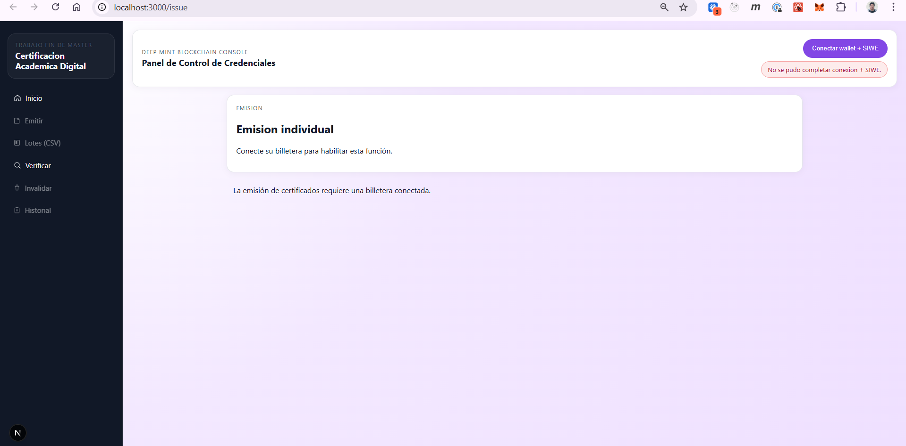
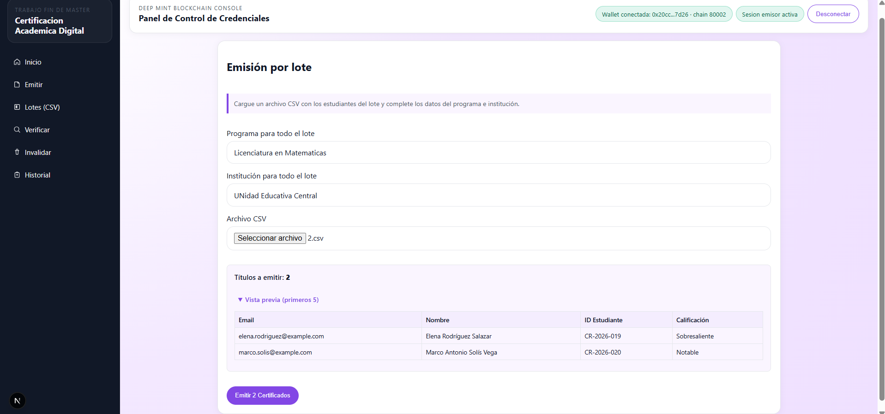
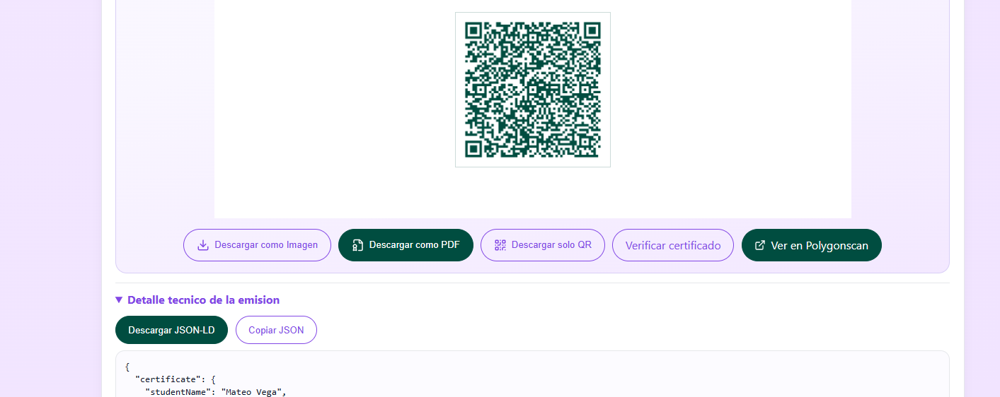
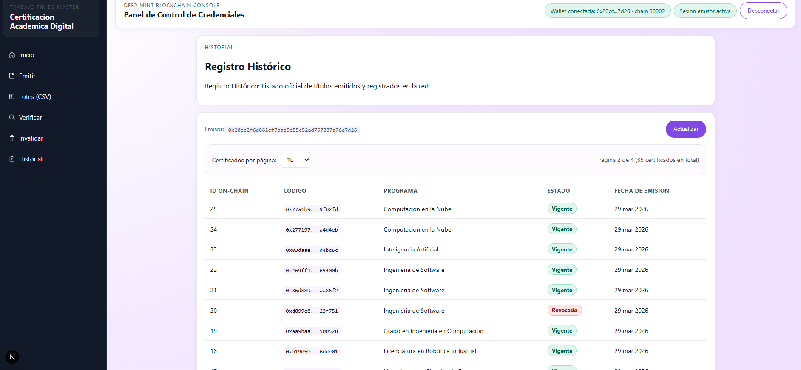

# Manual de Usuario

Fecha de actualizacion: 29 de marzo de 2026

## 1. Objetivo

Esta aplicacion permite emitir, consultar, verificar e invalidar certificados academicos registrados en blockchain. El sistema esta pensado para dos perfiles principales:

- Emisor: institucion o responsable autorizado para emitir e invalidar certificados.
- Verificador: persona o entidad que desea comprobar la autenticidad de un certificado.

## 2. Requisitos previos

Antes de utilizar la plataforma, tenga en cuenta lo siguiente:

- Para emitir, invalidar o consultar el historial es necesario conectar MetaMask.
- La red esperada para operaciones de blockchain es Polygon Amoy.
- La emision y la invalidacion requieren sesion validada como emisor.
- La verificacion por codigo puede realizarse sin perfil emisor.
- La verificacion por archivo requiere disponer del archivo JSON del certificado.

## 3. Navegacion principal

La aplicacion ofrece los siguientes accesos:

- Inicio
- Emitir
- Lotes (CSV)
- Verificar
- Invalidar
- Historial

Pantalla general de acceso:

## 4. Autenticacion del emisor

Las acciones de emision, invalidacion e historial oficial dependen de la billetera conectada.

Pasos generales:

1. Abra la plataforma.
2. Conecte su billetera MetaMask cuando la interfaz lo solicite.
3. Valide la sesion firmando el mensaje de autenticacion.
4. Verifique que la red activa sea Polygon Amoy.
5. Una vez validada la sesion, podra emitir o invalidar certificados.

Si la billetera no esta conectada o la sesion no esta validada, la aplicacion mostrara avisos y bloqueara las acciones sensibles.

## 5. Emision individual de certificado

La vista de emision individual permite registrar un titulo academico para una sola persona.

Campos principales:

- Nombre completo del estudiante
- Identificador academico del estudiante
- Correo electronico del estudiante
- Programa academico o curso
- Institucion emisora

Campos opcionales:

- Descripcion publica del certificado
- Sitio web oficial de la institucion
- Fecha de expiracion
- Codigo del certificado anterior a reemplazar, en caso de reemision

Procedimiento:

1. Acceda a la opcion Emitir.
2. Complete los datos obligatorios del estudiante y del programa.
3. Si aplica, complete metadatos opcionales, fecha de expiracion o reemplazo de un certificado previo.
4. Conecte la billetera y valide la sesion de emisor.
5. Pulse Emitir certificado.
6. Espere la confirmacion del proceso.
7. Revise el resultado mostrado en pantalla.

Resultado esperado:

- El certificado queda registrado.
- Se muestra el codigo de verificacion.
- Se informa el estado de la transaccion.
- Si fue una reemision, el sistema indicara si el certificado anterior fue invalidado automaticamente.

## 6. Emision por lote con CSV

La emision por lote permite cargar varios certificados en una sola operacion mediante un archivo CSV.

Procedimiento:

1. Acceda a la opcion Lotes (CSV).
2. Seleccione el archivo CSV desde su equipo.
3. Revise la vista previa de registros cargados.
4. Verifique la cantidad total de titulos a emitir.
5. Conecte la billetera y valide la sesion si aun no lo hizo.
6. Pulse Emitir certificados.
7. Siga el avance del proceso en pantalla.

Durante la ejecucion, la interfaz muestra:

- Cantidad de documentos cargados.
- Progreso de publicacion y almacenamiento.
- Progreso de registro en la red.
- Resultado final del lote, incluyendo registros exitosos y fallidos.

Recomendaciones:

- Revise el archivo antes de enviarlo para evitar errores masivos.
- Use la vista previa para detectar filas con datos incorrectos.
- No cierre la ventana mientras el lote este en proceso.

## 7. Verificacion de certificados

La plataforma ofrece dos modos de verificacion.

### 7.1 Verificacion por codigo

Esta opcion consulta el estado del certificado usando su codigo de verificacion.

Procedimiento:

1. Acceda a Verificar.
2. Introduzca el codigo de verificacion.
3. Pulse Consultar estado.
4. Espere la respuesta del sistema.

La aplicacion puede mostrar:

- Registro encontrado o no encontrado.
- Vigencia del certificado.
- Emisor asociado.
- Fecha de emision registrada.
- Estado del certificado: Valido, Revocado o Expirado.

### 7.2 Verificacion por archivo

Esta opcion analiza el archivo JSON del certificado y comprueba su integridad.

Procedimiento:

1. Seleccione la verificacion por archivo.
2. Cargue el archivo JSON del certificado.
3. Si lo desea, introduzca el correo del destinatario para una comprobacion adicional.
4. Ejecute la validacion.
5. Revise el resultado integral.

Resultado esperado:

- Validacion de estructura del documento.
- Verificacion del hash y consistencia del contenido.
- Comprobacion de firma y datos asociados.
- Estado final del certificado.

Cuando el resultado es valido, el sistema puede generar un comprobante PDF de verificacion.

## 8. Invalidacion o revocacion de certificados

La opcion Invalidar permite dejar sin vigencia un certificado ya emitido.

Requisitos:

- MetaMask disponible.
- Billetera conectada.
- Sesion de emisor activa.
- Red correcta: Polygon Amoy.

Procedimiento:

1. Acceda a Invalidar.
2. Verifique que la interfaz confirme red validada y sesion activa.
3. Introduzca el ID del certificado.
4. Escriba el motivo oficial de invalidacion.
5. Pulse Invalidar Certificado.
6. Confirme la transaccion en MetaMask.
7. Espere el resultado final.

Resultado esperado:

- Confirmacion de invalidacion.
- ID del certificado afectado.
- Motivo registrado.
- Codigo de transaccion.
- Direccion del ejecutor.

## 9. Historial de certificados

El historial muestra los certificados emitidos por la billetera conectada.

Procedimiento:

1. Conecte la billetera.
2. Acceda a Historial.
3. Espere la carga de registros.
4. Revise la tabla oficial de certificados emitidos.

La tabla muestra:

- ID on-chain
- Codigo del certificado
- Programa academico
- Estado
- Fecha de emision

Funciones disponibles:

- Actualizar listado.
- Seleccionar cantidad de elementos por pagina: 10, 25, 50 o 100.
- Navegar entre paginas con los botones Anterior y Siguiente.

Si no hay billetera conectada, esta funcionalidad permanece bloqueada.

## 10. Resultados y estados posibles

Los estados principales que puede devolver el sistema son:

- Valido: el certificado existe y se encuentra vigente.
- Revocado: el emisor invalido el certificado.
- Expirado: el certificado supero su vigencia.
- No encontrado: no existe un registro asociado al codigo consultado.

Ejemplo de resultado visual de emision satisfactoria:

## 11. Errores frecuentes

### Billetera no conectada

La plataforma bloquea la accion y solicita conectar MetaMask.

### Sesion no validada

La aplicacion pedira firmar el mensaje de autenticacion antes de emitir o invalidar.

### Red incorrecta

Si MetaMask no esta en Polygon Amoy, la interfaz mostrara un aviso y no permitira continuar con operaciones de blockchain.

### Archivo JSON invalido

En la verificacion por archivo, el sistema mostrara un error si el documento no contiene JSON valido o no cumple la estructura esperada.

### Codigo de verificacion inexistente

La consulta informara que el certificado no fue encontrado.

## 12. Buenas practicas de uso

- Revise cuidadosamente los datos antes de emitir o invalidar.
- Mantenga MetaMask conectada mientras complete operaciones en blockchain.
- Conserve el codigo de verificacion y el archivo JSON del certificado emitido.
- Verifique siempre el estado final despues de una emision o invalidacion.
- Utilice la emision por lote solo cuando el archivo CSV haya sido revisado previamente.
