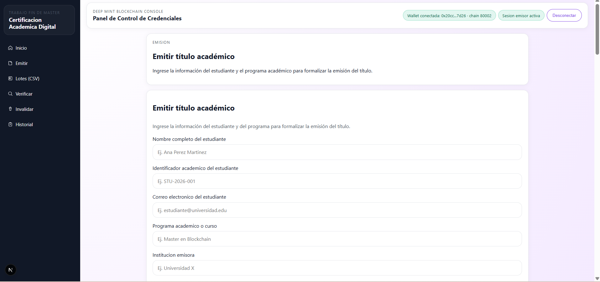
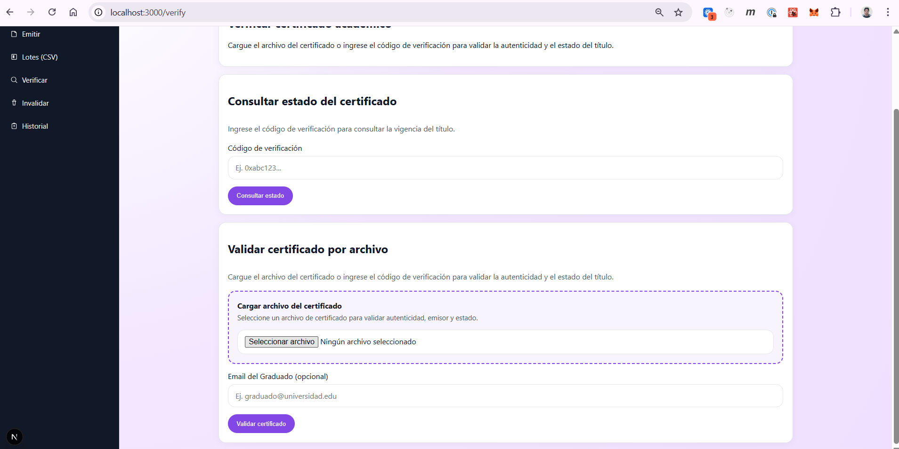
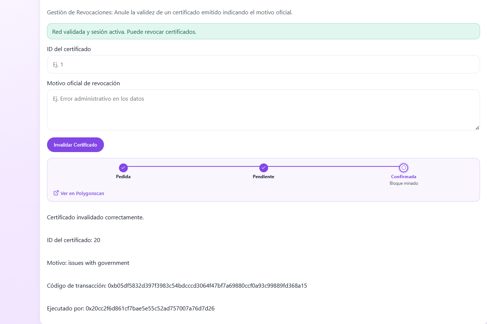
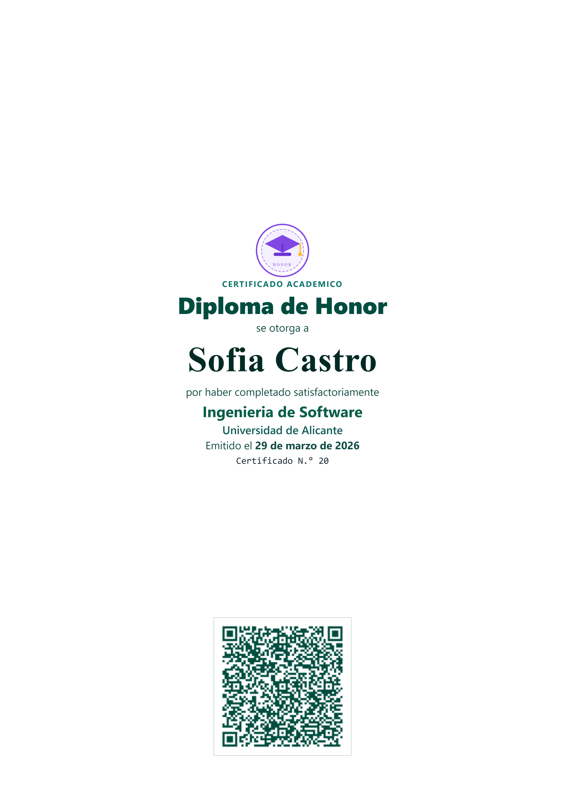

# User Manual

Last updated: March 29, 2026

## 1. Objective

This application allows issuing, querying, verifying, and invalidating academic certificates registered on blockchain. The system is designed for two main profiles:

- Issuer: institution or authorized operator able to issue and invalidate certificates.
- Verifier: person or entity that wants to confirm certificate authenticity.

## 2. Prerequisites

Before using the platform, consider the following:

- To issue, invalidate, or check history, MetaMask must be connected.
- Expected blockchain network is Polygon Amoy.
- Issuance and invalidation require validated issuer session.
- Verification by code can be done without issuer profile.
- Verification by file requires the certificate JSON file.

## 3. Main navigation

The application offers these entries:

- Home
- Issue
- Batch (CSV)
- Verify
- Invalidate
- History

General access screen:

## 4. Issuer authentication

Issuance, invalidation, and official history actions depend on connected wallet.

General steps:

1. Open platform.
2. Connect MetaMask wallet when requested by interface.
3. Validate session by signing authentication message.
4. Verify active network is Polygon Amoy.
5. Once session is validated, you can issue or invalidate certificates.

If wallet is not connected or session is not validated, application will show warnings and block sensitive actions.

## 5. Single certificate issuance

Single issuance view allows registering an academic title for one person.

Main fields:

- Student full name
- Student academic identifier
- Student email
- Academic program or course
- Issuing institution

Optional fields:

- Public certificate description
- Official institution website
- Expiration date
- Previous certificate code to replace, in case of re-issuance

Procedure:

1. Go to Issue option.
2. Complete required student and program data.
3. If needed, complete optional metadata, expiration date, or replacement of previous certificate.
4. Connect wallet and validate issuer session.
5. Click Issue certificate.
6. Wait for process confirmation.
7. Review result shown on screen.

Expected result:

- Certificate is registered.
- Verification code is displayed.
- Transaction status is shown.
- If this was re-issuance, system indicates whether previous certificate was automatically invalidated.

## 6. Batch issuance with CSV

Batch issuance allows loading multiple certificates in one operation through CSV file.

Procedure:

1. Go to Batch (CSV) option.
2. Select CSV file from your computer.
3. Review preview of loaded records.
4. Verify total number of titles to issue.
5. Connect wallet and validate session if not already done.
6. Click Issue certificates.
7. Follow process progress on screen.

During execution, interface shows:

- Number of loaded documents.
- Publication and storage progress.
- Network registration progress.
- Final batch result, including successful and failed records.

Recommendations:

- Review file before sending to avoid massive errors.
- Use preview to detect rows with incorrect data.
- Do not close window while batch is running.

## 7. Certificate verification

Platform offers two verification modes.

### 7.1 Verification by code

This option queries certificate status using verification code.

Procedure:

1. Go to Verify.
2. Enter verification code.
3. Click Check status.
4. Wait for system response.

Application may show:

- Record found or not found.
- Certificate validity.
- Associated issuer.
- Registered issuance date.
- Certificate status: Valid, Revoked, or Expired.

### 7.2 Verification by file

This option analyzes certificate JSON file and checks integrity.

Procedure:

1. Select verification by file.
2. Upload certificate JSON file.
3. If desired, enter recipient email for additional check.
4. Run validation.
5. Review full result.

Expected result:

- Document structure validation.
- Hash verification and content consistency.
- Signature and associated data checks.
- Final certificate status.

When result is valid, system can generate a verification PDF receipt.

## 8. Certificate invalidation or revocation

Invalidate option allows removing validity from an already issued certificate.

Requirements:

- MetaMask available.
- Wallet connected.
- Active issuer session.
- Correct network: Polygon Amoy.

Procedure:

1. Go to Invalidate.
2. Verify interface confirms validated network and active session.
3. Enter certificate ID.
4. Write official invalidation reason.
5. Click Invalidate Certificate.
6. Confirm transaction in MetaMask.
7. Wait for final result.

Expected result:

- Invalidation confirmation.
- Affected certificate ID.
- Recorded reason.
- Transaction code.
- Executor address.

## 9. Certificate history

History shows certificates issued by connected wallet.

Procedure:

1. Connect wallet.
2. Go to History.
3. Wait for records to load.
4. Review official table of issued certificates.

The table shows:

- On-chain ID
- Certificate code
- Academic program
- Status
- Issuance date

Available functions:

- Refresh list.
- Select items per page: 10, 25, 50, or 100.
- Navigate between pages with Previous and Next buttons.

If no wallet is connected, this functionality remains blocked.

## 10. Possible results and states

Main states returned by system are:

- Valid: certificate exists and is currently valid.
- Revoked: issuer invalidated certificate.
- Expired: certificate exceeded validity period.
- Not found: no record exists for queried code.

Example visual result of successful issuance:

## 11. Frequent errors

### Wallet not connected

Platform blocks action and asks to connect MetaMask.

### Session not validated

Application requests signing authentication message before issuing or invalidating.

### Wrong network

If MetaMask is not on Polygon Amoy, interface will show warning and prevent blockchain operations.

### Invalid JSON file

In file verification, system shows error if document is not valid JSON or does not meet expected structure.

### Nonexistent verification code

Query reports that certificate was not found.

## 12. Good usage practices

- Carefully review data before issuing or invalidating.
- Keep MetaMask connected while completing blockchain operations.
- Keep verification code and certificate JSON file.
- Always verify final status after issuance or invalidation.
- Use batch issuance only when CSV has been reviewed in advance.
